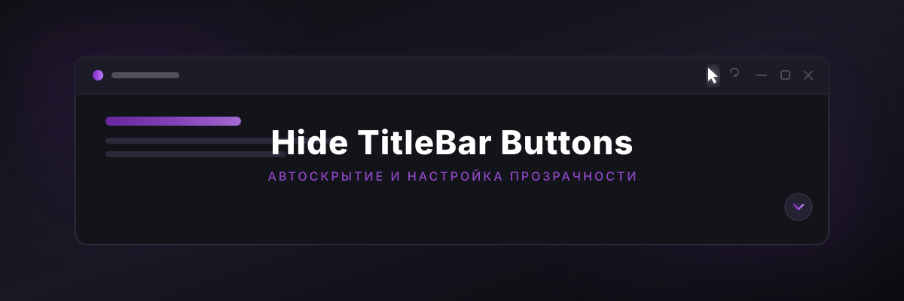

# Hide TitleBar Buttons

Минималистичный аддон для Яндекс Музыки, который автоматически скрывает кнопки управления окном и кнопку закрытия полноэкранного плеера, делая интерфейс чище и привлекательнее.

## 🛠 Настройки

В меню настроек аддона доступны следующие параметры:

1. **Верхняя панель управления (TitleBar)**
   * `Автоскрытие кнопок окна` — Включение / выключение функции.
   * `Прозрачность в покое` — Ползунок от `0.0` (полносью скрыты) до `1.0` (полностью видимы).

2. **Кнопка сворачивания полноэкранного режима**
   * `Автоскрытие кнопки сворачивания` — Включение / выключение функции.
   * `Прозрачность в покое` — Ползунок уровня прозрачности стрелочки.

---

## 📦 Установка

1. Скачайте последнюю версию аддона или склонируйте репозиторий.
2. Поместите папку с аддоном в директорию `addons` приложения.
3. Включите **Hide TitleBar Buttons** в списке установленных расширений.

---

## 📄 Лицензия

[MIT](LICENSE)
